# 263集团品牌指南Skill——让你的 AI 助手交付合规的263品牌内容


**当前版本：v1.1.1**（与 `SKILL.md` frontmatter `version` 一致，以此为准）

把 263 集团的 VI 规范、公司数据和文档标准做成 Agent 可执行的规则，支持 PPT 和网页输出，对外展示自动合规审查。　[快速开始](#快速开始)　·　[模型推荐](#模型推荐)　·　[路线图](#路线图)

> **当前能力范围**：本 Skill 当前仅支持 **集团红视觉 + 集团红心 Logo**。暂不支持子品牌（如云通信）Logo / 视觉的生成与改写——携带子品牌 Logo 的成品在改写时会调整为集团红视觉。

***

## 目录

- [效果展示](#效果展示)
- [产品定位](#产品定位)
- [快速开始](#快速开始)
- [为什么选择263品牌指南Skill？](#为什么选择263品牌指南skill)
- [不做什么](#不做什么)
- [架构设计](#架构设计)
- [模型推荐](#模型推荐)
- [FAQ](#faq)
- [后续计划](#后续计划)
- [路线图](#路线图)
- [更新日志](#更新日志)
- [许可证](#许可证)

***

## 效果展示

演示文稿统一生成 16:9 画布（适合投屏演示），文档材料可生成竖版长页（适合屏幕前阅读）。

### 1. 演示文稿

#### 1.1 封面和结尾页

| 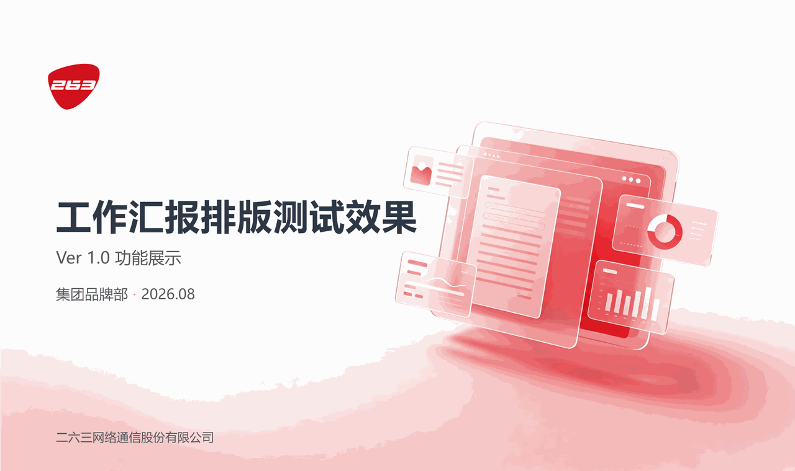 |  | 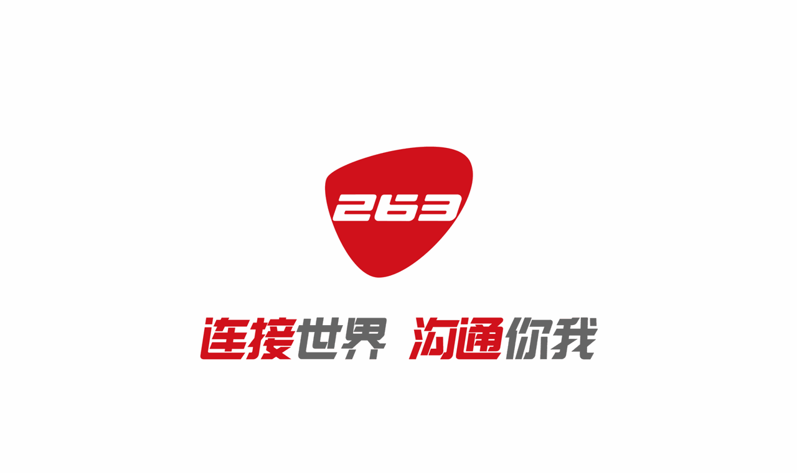 |
| :------------------------------------------------------: | :---------------------------------------------------------: | :------------------------------------------------: |
|                工作汇报 · 封面（固定样式，Agent 不可替换）                |                   对外展示 · 封面（内嵌兜底封面图，可自由替换）                  |                结尾页（固定样式，Agent 不可替换）                |

#### 1.2 完整PPT效果

*完整演示文稿生成效果，包含封面、目录、章节、内容、图表、表格、时间线、结尾页*

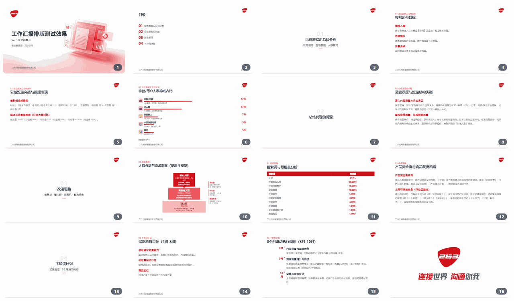

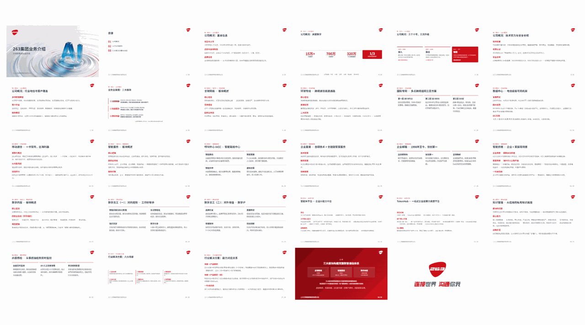

### 2. 文档材料

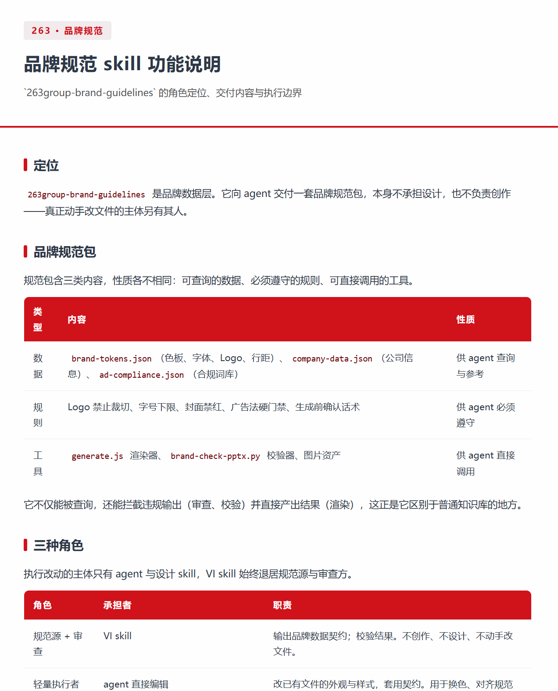

*文档材料 · 竖版长页（适合屏幕前阅读）*

***

## 产品定位

**263 集团品牌指南**是一份 Agent Skill：把集团的 VI 视觉规范做成 Agent 能直接读取、照着执行的数据和规则，让你的 AI 工具自动帮你产出符合公司视觉规范的演示文稿（.pptx）和网页文件（.html）（.docx 将在后续支持）。

**🤔 解决什么问题**

你可能有过这种经历：要做一份汇报，打开 PPT 模板还是拿不准该用哪个红、用什么字体，简单排版也要花好几个小时。

你可能也有这种苦恼：要给客户做一份方案，要先检索最新版公司简介、业务和产品介绍，凑齐基础资料已经花费大半天时间。

这份技能把品牌 VI 规范、公司信息和业务介绍、文档标准模板三要素合一，从「人先给 AI 找素材」变成「Agent 能自动摘信息，照着做的规则」。你只负责把需求说清楚，剩下的交给 AI。

**🎯 适用场景**

当前 Skill 已覆盖对内 / 对外两类场景：内部使用即工作汇报（包含工作复盘、述职汇报、定期汇报等），对外使用即营销宣传（包含公司介绍、产品宣传、展览展示等）。

**🚫 它不做什么**

这个 Skill 不能帮你做出精美排版设计，只负责工作流，生成上限由模型和 Agent 能力决定。不过它可以配合其他设计类技能或插件协作生成。

**💡 特别提醒**

请理性期待成品效果：仅凭 AI 无法一把做到完美。AI 帮你把大部分枯燥的动作做完，接近完美的成品还需要你亲自打磨。

***

## 快速开始

### 前置条件

你只需要一个支持安装第三方 Skill 的 AI 工具。无需安装 Python、Node.js 等运行环境——Agent 会自动处理。

### 1. 选择一个 Agent

本 Skill 理论上支持所有可安装第三方 Skill 的 Agent，以下为已测试跑通的工具：

| 类型           | 代表工具                                 | 说明                     |
| ------------ | ------------------------------------ | ---------------------- |
| AI 办公工具      | WorkBuddy、飞书（豆包工作）、千问办公              | 具备成熟的办公工具生态，客户端下载，即开即用 |
| CLI Agent    | Claude Code CLI、Codex CLI、Gemini CLI | 终端运行，命令行安装             |
| IDE 内置 Agent | Trae、VS Code                         | 编辑器原生集成，支持 Skill 安装    |

### 2. 安装和配置

> **特别提醒**：如果你看不懂下述安装方式，请直接把本文档或克隆链接丢给你的 Agent，它会自动帮你安装好 😄

**方式 A — Git clone**（推荐；需先安装 [Git](https://git-scm.com/downloads)）：

```bash
git clone https://github.com/263-BRAND/brand-guidelines.git
```

克隆后，把 `263group-brand-guidelines/` 目录复制或链接到你的 Agent 工具的 skills 目录即可。

> 本 Skill 无需安装任何运行依赖——Agent 会自动处理脚本执行环境。

**方式 B — 下载 ZIP**（无需安装 Git，适合快速体验）：

前往 [GitHub Releases](https://github.com/263-BRAND/brand-guidelines/releases) 下载最新版 `263group-brand-guidelines-v<版本号>.zip`（当前最新：**v1.1.1**，与顶部「当前版本」一致）

解压后同样把 `263group-brand-guidelines/` 目录放到 Agent 的 skills 目录。**确认安装成功**：`263group-brand-guidelines/` 文件夹应包含 `SKILL.md`、`brand-tokens.json`、`company-data.json`、`ad-compliance.json`、`generate.js` 这 5 个核心文件。

> 客户端工具（WorkBuddy、飞书、千问办公）可直接在界面上传 zip，无需手动解压。安装成功后可在技能列表中看到本 Skill。

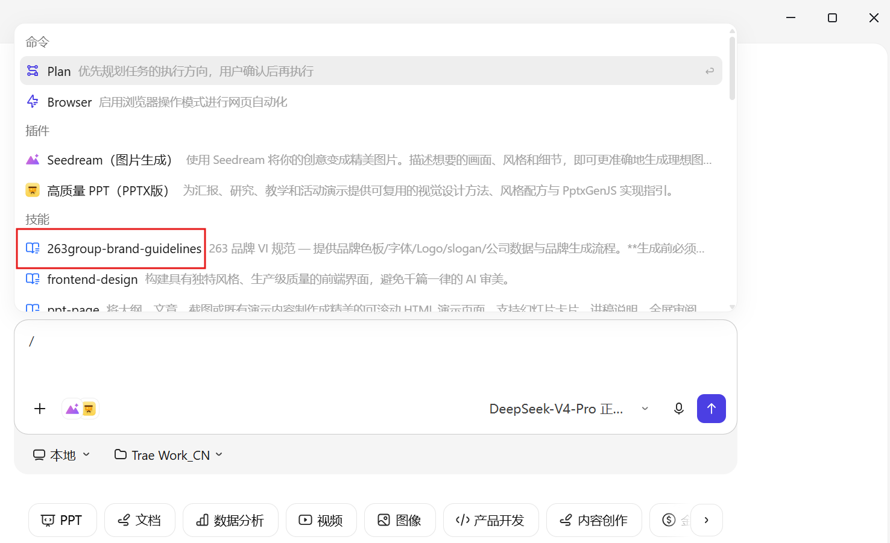

*与 Agent 对话时输入「/」，可看到技能已加载，即技能安装成功*

#### 🔄 日常更新

**Git clone 安装：**

```bash
cd brand-guidelines && git pull
```

**下载 ZIP 安装：**

重新下载最新版 ZIP，解压后覆盖旧的 `263group-brand-guidelines/` 目录即可。

> 更新后需**新开对话**才能生效（Skill 在会话启动时加载）。

### 3. 开始使用

从一句需求到拿到品牌合规文件，只需三步。

#### 第 1 步 · 创建任务并加载 Skill

在 Agent 中创建新对话，添加本 Skill，然后把原始材料放进来。比如，上传已写好的内容大纲、必要的配图、数据等，让 Agent 帮你做一个汇报 PPT：

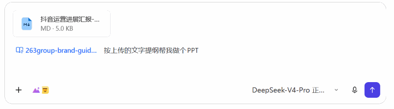

Skill 也支持对文件的品牌规范轻量化改写。比如，你希望让 Agent 帮你改成合乎公司风格的配色，加上公司 Logo，可以试试这样说：

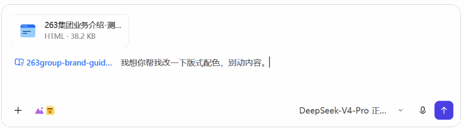

#### 第 2 步 · 回答确认问题

Agent 会初步判断你的需求，从场景、用途到交付格式逐项与你确认，全部确认后才会动手（如 Agent 选择直接交付，中途未确认，你可以随时打断，要求它修正）。

| 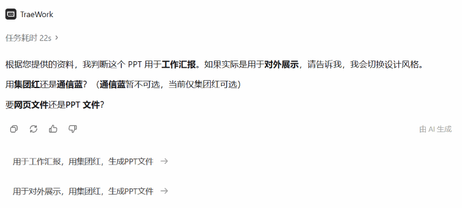 | 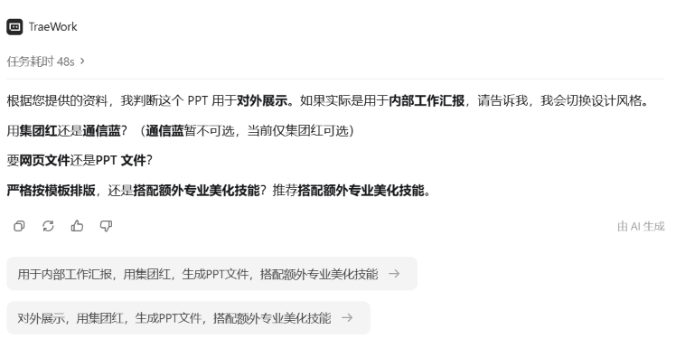 |
| :---------------------------------------: | :------------------------------------------: |
|            制作演示文稿的前置确认，以工作汇报为例            |      制作对外展示类演示文稿，推荐配合其他设计类技能共同制作以生成更佳效果      |

#### 第 3 步 · 拿到文件

Agent 生成文件，并自动跑品牌合规校验（颜色白名单 / 字体 / 图片内嵌 / 结尾页位置，对外展示会增加公司信息核对 / 广告法极限词合规审查），校验不通过不交付。因此你只需要耐心等待，Agent 会自动完成校验并交付。Agent可能会执行的步骤有以下这些：

如果是对外展示类文件，Agent还会按照skill要求检查广告法极限词，命中即中断工作，等你确认是否修改再继续。
广告法极限词审查示例：

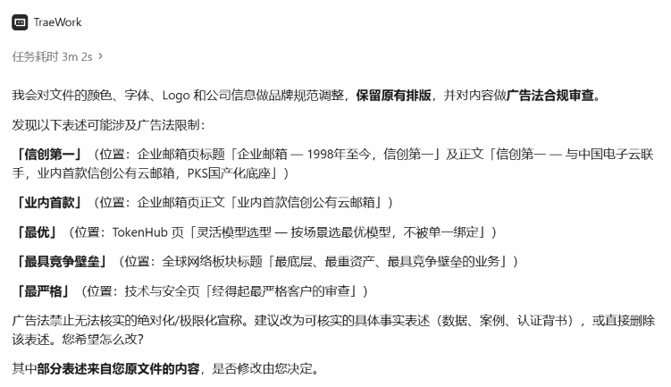

***

## 为什么选择263品牌指南Skill？

- **品牌数据一次到位** — 色板、字体、Logo、公司信息、合规词库集中管理，Agent 从数据文件读取，不会再搞错色号、用错字体
- **先确认再动手，不返工** — 生成前逐项确认场景、配色、格式，全部确认后一次生成，不用来回改
- **对外展示自动合规** — 自动扫描广告法极限词，命中即拦截，改到干净才放行
- **HTML 和 PPT 都能出** — 汇报用 PPT，分享用网页，一个 Skill 覆盖两种场景
- **旧文件也能改造** — 已有 HTML/PPT 文件直接品牌化改写，换色换 Logo 对齐公司数据，保留原排版不动
- **自动检查，不达标不交付** — 生成后自动跑合规校验，颜色不对、字体不对、结尾页缺失一律不输出
- **不绑定工具和模型** — 支持多种 Agent 和主流模型，不会锁定在任何单一平台。唯一需要关注的是你的 Token 消耗

***

## 不做什么

明确的能力边界，避免误用：

- **不负责排版美观** — 版式、布局、动效由设计技能或渲染器负责，本 Skill 只锁品牌底线
- **不直接负责PPT的美化排版** — PPT 版式依赖外部设计技能或代码生成，本 Skill 提供的是品牌数据契约
- **不审查工作汇报** — 广告法合规审查仅针对对外展示，内部汇报不审查
- **不代写违禁词替代方案** — 只标记命中词和修改方向，改写必须是用户自己的事实性表述（同义替换同样可能违规）
- **不跳过人工确认** — 生成前确认是硬门禁，AI 不得假设默认值代替用户决定
- **不生成 / 不改写子品牌视觉** — 当前仅集团红 + 集团红心 Logo；子品牌（云通信等）Logo / 视觉暂不支持，带子品牌 Logo 的成品改写时会调整为集团红视觉

***

## 架构设计

```
┌─────────────────────────────────────────────────────┐
│                   AI Agent / 对话交互                  │
│                                                       │
│  ┌─────────────┐   ┌──────────────┐   ┌────────────┐  │
│  │  场景判断     │ → │  生成前确认    │ → │  读取品牌数据│  │
│  │  (内部动作)   │   │  (逐项问用户)  │   │  (JSON 文件) │  │
│  └─────────────┘   └──────────────┘   └────────────┘  │
│                                               │       │
│                          ┌────────────────────┘       │
│                          ▼                             │
│              ┌───────────────────────┐                 │
│              │   品牌数据层 (本 Skill)  │                 │
│              │                       │                 │
│              │  brand-tokens.json    │  色板/字体/Logo  │
│              │  company-data.json    │  公司/产品/里程碑 │
│              │  ad-compliance.json   │  广告法词库      │
│              │  SKILL.md             │  规则/流程/话术  │
│              └───────────────────────┘                 │
│                          │                             │
│           ┌──────────────┴──────────────┐              │
│           ▼                              ▼              │
│  ┌───────────────┐           ┌─────────────────┐       │
│  │  HTML 渲染器    │           │  PPTX 生成路径    │       │
│  │  generate.js   │           │  + brand-check   │       │
│  │  + renderer/   │           │  -pptx.py        │       │
│  │  +check-html.py│           │                  │       │
│  └───────────────┘           └─────────────────┘       │
│           │                              │              │
│           ▼                              ▼              │
│     单文件 .html                  .pptx 文件             │
│     (零依赖, 浏览器打开)        (PowerPoint 16:9)        │
└─────────────────────────────────────────────────────┘
```

***

## 模型推荐

本 Skill 的执行效果高度依赖模型和 Agent 的能力，三项能力直接决定成败：

| 能力   | 作用                               | 弱模型的典型偏差               |
| ---- | -------------------------------- | ---------------------- |
| 指令遵循 | 生成前确认话术逐字执行、流程步骤不跳过              | 跳过提问直接生成、漏跑校验脚本        |
| 工具调用 | 读取 JSON 数据文件、执行 node / python 脚本 | 凭记忆编造品牌数据、绕过渲染器手写 HTML |
| 中文理解 | 话术、品牌词库、广告法审查均为中文语境              | 话术表达走样、违禁词漏检           |

**选型原则**：优先选用当前平台指令遵循能力最强的旗舰档模型。模型越弱，执行偏差越大——跳过确认、漏跑校验、编造色值都是已知偏差模式。

**模型推荐**

推荐 DeepSeek-V4-Flash / DeepSeek-V4-Pro、GPT-5.6、Claude。其他模型能跑通流程，但有质量差距。

***

## FAQ

**为什么 AI 总是先问一堆问题才动手？**

生成前确认是硬门禁——防止配色、格式、场景理解错误导致整份文件返工。全部确认后才会开始生成，AI 不允许假设默认值。

**为什么我的工作汇报没做广告法审查？**

广告法审查仅针对对外展示内容。工作汇报是内部材料，不审查。

**上传了新版 zip，AI 还是用旧规范生成？**

更新陷阱：仅把 zip 作为对话附件不会替换已安装版本。必须走「技能管理 → 上传 zip 安装」入口，先删除旧版再装新版，装完新开会话（技能在会话启动时加载）。

**怎么确认我装的 skill 是哪个版本？**

① 打开已安装的 `263group-brand-guidelines/` 文件夹，看 `SKILL.md` 头部 frontmatter 的 `version` 字段——应为 `1.1.1`（与本文顶部「当前版本」一致）。旧版无 `version` 字段或版本号更低，说明装的不是最新版。

② **更省事的办法**：新版 Skill 每次生成前会主动报出「当前加载的品牌指南版本为 vX.Y.Z」——直接看它报的版本号即可。报了旧号 = 没装对，按下面「更新陷阱」重装。

**生成的 HTML 怎么播放？**

浏览器直接打开，支持全屏（F11）、键盘翻页（方向键 ←/→ 前后翻页，Home / End 首尾）。为避免汇报时误触，点击页面任意位置不翻页——翻页仅限键盘。刷新自动恢复上次浏览位置。

**可以把结尾页改成「谢谢观看」吗？**

不能。VI 标准结尾页是居中 Logo + slogan PNG，必须是最后一页，渲染器和检查脚本都强制校验。

**支持改写 Word / Excel 文件吗？**

暂不支持。提交 docx / xlsx 会明确告知暂不支持，可转为 HTML 处理，阅读效果相同。

**收到的文件颜色不对怎么办？**

正常情况不会发生——颜色白名单校验不通过会直接 exit 1 拒绝交付。如果收到了违规文件，说明走了设计技能自由路径，按「PPTX 生成后自查」清单人工核对。

***

## 后续计划

以下是已列入规划、将在后续版本中逐步支持的功能：

- **Word / Excel 支持** — 扩展品牌化改写和合规审查到 .docx / .xlsx 格式，补齐办公文档全场景覆盖
- **通信蓝配色方案** — 暂不支持，待后续开放，届时支持集团红 / 通信蓝双色方案
- **.docx 格式输出** — 在现有 HTML / PPTX 输出基础上，新增 .docx 文件直接生成能力

***

## 路线图

### 已完成

- 集团红配色方案（9 色 + 语义色 + 7 档图表色阶）
- 工作汇报封面（红色位图母版，统一风格）
- 对外展示封面（兜底封面图 + 设计技能自由路径）
- HTML 渲染器（8 种页面类型 + 颜色白名单 + 广告法 fail-loud）
- HTML 合规检查脚本 `brand-check-html.py`（颜色白名单 / 字体 / 图片内嵌 / 结尾页位置）
- PPTX 合规检查脚本（颜色 / 红底文字 / 结尾页 / 图片内嵌 / 字体）
- 广告法合规词库（80+ 违禁词 + 11 豁免短语）
- 改写已有文件功能 Phase 2（HTML / PPTX 品牌化改写，用途分流，换色映射）

### 待解决

**LLM/Agent 执行偏差** — 不同模型的执行偏差会导致跳过步骤或审查。当前实现方法（SKILL.md 声明式规则 + generate.js 机器闸门 + brand-check 脚本交付断言）已接近 Agent 声明式能力的上限。计划将 SKILL.md 编译为 harness，每一步由代码执行，目标将执行效果提升至 80%。

**改写能力扩展** — Phase 2 仅支持 HTML / PPTX 改写，docx / xlsx 暂不支持。计划扩展文件格式覆盖面。

**多模态能力扩展** — 当下以 HTML 和 PPTX 为重心。计划支持 HTML 复杂框架（代码动效、思维导图、生图模型约束），迭代为多模态 VI 规范，实现文档、图片、视频均规范化生产交付。

**通信蓝配色方案** — 暂不支持，待后续开放。

***

## 更新日志

各版本更新记录见 [`CHANGELOG.md`](CHANGELOG.md)（新增 / 修复分块，倒序排列）。当前版本：**v1.1.1**（2026-08-26 更新），每次发版会在 [GitHub Releases](https://github.com/263-BRAND/brand-guidelines/releases) 同步发布说明。

***

## 许可证

内部使用，版权归 263 集团所有。品牌素材（Logo、slogan）仅供 263 品牌内容生成使用，不得用于其他用途。
